# seoul-scenario2-tech-detail

# 시나리오 2 기술 상세 설명 및 도식화

서울시 음식점 데이터를 매주 최신 상태로 유지하기 위해 **Spring Batch + 메시지 큐 + Python 워커** 조합(시나리오 2)을 채택했다. 이 문서는 백엔드 기술이나 데이터 파이프라인 지식이 전혀 없는 사람도 “무엇을 어떻게 준비해야 하는지” 이해할 수 있도록, 비유와 단계별 준비 절차까지 포함해 설명한다.

---

# 1. 전체 이야기: “주간 식당 정보 공장”

1. **스케줄러(Scheduler)**가 일요일 새벽 2시에 공장을 깨워 “이번 주 물량을 가져오자!”라고 신호를 보낸다.
2. **수집 단계(Spring Batch)**가 서울시 API에서 음식점 데이터를 가져와 가장 먼저 **임시 창고(Stage 테이블)**에 보관한다. 이 창고는 원본을 모아두는 버퍼 공간이다.
3. 새로 들어온 상자(신규/변경된 데이터)마다 “이 상자를 손질해야 해요”라는 쪽지를 **메시지 큐**에 넣는다.
4. **Python 워커**가 메시지 큐에서 쪽지를 하나씩 꺼내 주소 변환, 전화번호 정리 등 가공을 수행한다.
5. 손질이 끝난 상자는 **정제 전용 테이블(Stage Clean)**에 저장되고, 마지막으로 운영 DB(`places`)로 옮겨져 고객에게 노출된다.
6. 모든 과정은 **메타데이터 기록**과 **알람**으로 추적되며, 실패한 상자는 **재처리 창구(DLQ)**로 보내져 다시 처리된다.

---

# 2. 임시 창고(Stage 테이블)와 Spring Batch 작업

## 2.1 Stage 테이블이란?

- 운영 DB(PostgreSQL/PostGIS)에 `etl`이라는 전용 스키마를 만들고 `stage_places_raw` 같은 테이블을 생성한다.
- 수집 직후 “가공 전” 원본 데이터를 담아두는 **임시 창고** 역할을 한다.
- 이후 정제 과정에서 문제가 생겨도 Stage에서 원본을 다시 꺼내 재처리할 수 있다.

## 2.2 Stage 테이블 준비 절차 (비기술자용 체크리스트)

1. **DB 접근 권한 확인**: DBA나 인프라 담당자에게 `etl` 스키마 생성 권한이 있는지 확인한다.
2. **스키마/테이블 생성 요청**: DataGrip, DBeaver 같은 도구 또는 DBA를 통해 아래 항목을 전달한다. (SQL 문 작성이 어려우면 DBA에게 “stage_places_raw 테이블 필요”라고 요청)
    - 스키마명: `etl`
    - 테이블명: `stage_places_raw`
    - 주요 컬럼: `provider_id`, `raw_payload(JSON)`, `collected_at`, `etl_run_id`, `last_modified`
3. **용량 확인 요청**: 주간 10만 건 데이터를 최소 3~4주 보관할 수 있는지 확인하고, 상세 방법은 아래 2.3절을 따른다.
4. **인덱스 설정**: `provider_id`, `etl_run_id`, `last_modified`에 인덱스를 생성해 검색 속도를 유지한다.
5. **접근 기록**: 테이블 생성 후 위치(SQL 파일/Confluence 페이지 등)를 문서로 남겨 다른 팀원도 참고할 수 있게 한다.

## 2.3 Stage 테이블 용량 확인 방법

- **예상 데이터량 계산**: 한 주 동안 들어오는 레코드 수(예: 100,000건) × 레코드 크기(평균 8KB)를 곱해 대략적인 주간 용량을 산출한다. 계산이 어렵다면 “주간 약 800MB 필요”처럼 대략치만 잡아도 된다.
- **DBA에게 확인 요청**: RDS나 온프레미스 DB를 운영 중인 담당자에게 “`etl.stage_places_raw`를 포함해 최소 1개월치 데이터를 저장할 공간이 있는지” 문의한다. 필요하면 디스크 확장 작업을 요청한다.
- **직접 확인 옵션**
    1. pgAdmin, DataGrip 등 GUI에서 해당 테이블을 우클릭 → `Maintenance`/`Table Size` 메뉴로 현재 크기와 예상 증가치를 확인한다.
    2. SQL 실행 권한이 있다면 아래 명령을 복사해 DBA에게 전달하거나 실행한다. 결과는 사람이 읽기 쉬운 용량으로 반환된다.
        - `SELECT pg_size_pretty(pg_total_relation_size('etl.stage_places_raw'));`
        - `SELECT pg_size_pretty(pg_database_size(current_database()));`
- **모니터링 설정**: AWS RDS라면 CloudWatch의 `FreeStorageSpace` 지표에 알람을 걸고, 온프레미스라면 Grafana/Prometheus 대시보드에 디스크 사용률을 추가해 주기적으로 확인한다.
- **보존 전략 수립**: Stage 보관 기간을 4주로 정했다면, 5주 차 배치 실행 전에 가장 오래된 데이터를 삭제하도록 운영 절차에 포함한다.

### 2.3.1 용량 확인 흐름도

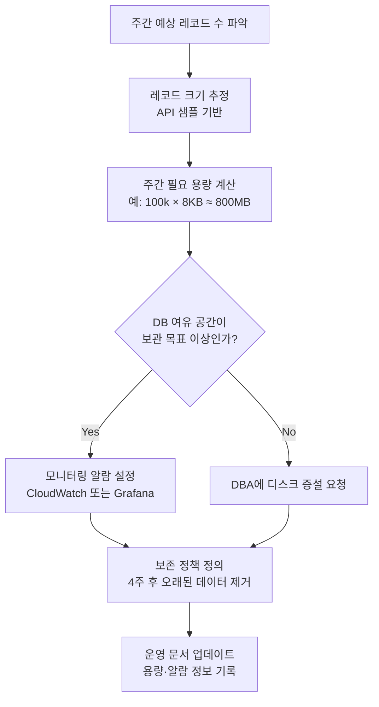

## 2.4 Batch Job이란? 왜 사용하고 어떻게 운영하나

- **정의**: Batch Job은 한 번에 많은 데이터를 묶어서 자동으로 처리하는 작업 묶음이다. 사람이 버튼을 누르지 않아도 정해진 시간에 “수집 → 정제 → 저장” 같은 과정을 차례대로 실행한다.
- **왜 필요한가?**
    - 매주 반복되는 일을 자동화해 사람이 밤중에 수동으로 실행할 필요가 없게 만든다.
    - 작업 단계를 순서대로 정의하면, 실패 시 어디에서 멈췄는지 한눈에 알 수 있어 복구가 쉽다.
    - 동일한 로직을 팀원 누구나 재실행할 수 있어 운영 품질이 일정하게 유지된다.
- **Spring Batch가 담당하는 역할**
    1. Job과 Step을 정의해 “어떤 순서로 무엇을 할지” 설계한다.
    2. 실행 이력(Job Repository)에 성공/실패와 소요 시간을 기록한다.
    3. 실패 시 특정 Step부터 다시 시작하는 재시작 기능을 제공한다.
- **운영 방법(기본)**
    1. 개발 환경에서 Job을 테스트한다 (`./gradlew bootRun` 혹은 IDE 실행).
    2. Docker 이미지로 패키징해 운영 서버나 Kubernetes에 배포한다.
    3. `@Scheduled` 또는 CronJob으로 매주 일요일 02:00에 자동 실행되도록 예약한다.
    4. 필요 시 수동 실행도 가능하게 API 또는 명령어(`java -jar app.jar --spring.batch.job.names=CollectJob`)를 마련해 둔다.

### 2.4.1 Batch Job 개념 도식

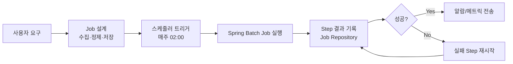

## 2.5 Job과 Step을 어떻게 나눌까?

- **Job 정의 원칙**
    - 하나의 Job은 “사용자가 바라보는 완결된 업무 단위”여야 한다. 예) “서울시 음식점 주간 동기화”.
    - Job이 끝나면 운영 DB가 최신 상태가 되고, 알람까지 발송된다는 명확한 완료 조건을 갖는다.
    - 서로 다른 주기·책임자를 갖는 작업이라면 Job을 별도로 만든다(예: 주간 동기화 Job vs. 월간 품질 리포트 Job).
- **Step 정의 원칙**
    - 한 Step은 “세부 과정 하나”에 해당한다. 입력·출력·성공 조건이 명확하고, 실패 시 재실행이 필요한 경계마다 Step을 나눈다.
    - 기술 스택이 달라지는 지점(예: Java에서 Python 컨테이너 호출)이나 저장소가 바뀌는 순간이 Step 경계가 된다.
    - 이번 시나리오에서는 `수집 → Stage 적재 → 메시지 발행` 세 구간이 자연스러운 Step 분리다.
- **Step 내부 처리 단위(Chunk Size) 기준**
    - ItemReader/ItemWriter를 사용하는 Chunk 기반 Step이라면 `chunkSize`는 100~1,000건 사이부터 시도한다.
    - 메모리 사용량이 높으면 줄이고, DB I/O 비용이 크면 늘리는 방식으로 조정한다.
    - 단일 API 호출/파일 다운로드처럼 “단 번에 끝나는 작업”은 Tasklet Step으로 구현한다.
- **체크포인트/재시작 고려**
    - **중요한 Step 기준**: Stage 적재, 메시지 발행처럼 데이터가 저장소를 옮기거나 양이 많은 작업, 외부 시스템 호출 등 “한 번에 끝나지 않으면 다시 전체를 돌리기 부담스러운 구간”을 말한다.
    - **체크포인트 활성화 의미**: Spring Batch가 Step 진행 상황(어디까지 읽고 썼는지)을 Job Repository(DB 테이블)에 저장하도록 `@EnableBatchProcessing` + `chunk-oriented processing`에서 `chunkSize`와 함께 `saveState=true`를 설정하는 것을 뜻한다.
    - **실패 후 재시작 동작**: 체크포인트가 저장된 Step은 다음 실행에서 Job Repository에 기록된 마지막 커밋 지점부터 이어서 처리한다. 이전 Step의 결과는 이미 Stage 테이블, 파일, 큐 등 원래 저장소에 반영된 상태이므로 다시 실행할 필요가 없다.
    - 외부 시스템 호출이 포함된 Step은 멱등성(idempotency)이 유지되는지 확인한 뒤 재시작 방식을 결정한다.

### 2.5.1 Job/Step 분리 의사결정

```mermaid
flowchart TD
    A[새 작업 요구사항 식별] --> B{독립된 업무 결과가 필요한가?}
    B -- Yes --> C[새로운 Job 생성]
    B -- No --> D[기존 Job 내부 Step 고려]
    C --> E{여러 단계로 구성되어 있는가?}
    D --> E
    E -- Yes --> F[각 단계를 Step으로 분리 / 입력-출력-성공 기준 정의]
    E -- No --> G[단일 Step(Tasklet) 유지]
    F --> H{대량 데이터를 반복 처리하는가?}
    H -- Yes --> I[Chunk Step 사용 / ItemReader-Processor-Writer + chunkSize]
    H -- No --> J[Tasklet Step 사용]
    I --> K[체크포인트 활성화 / saveState=true]
    J --> K
```

## 2.6 Job Repository는 무엇이며 어디에 둘까?

- **Stage 테이블과 별도**: Job Repository는 배치 실행 상태를 기록하는 Spring Batch 전용 테이블 모음(`BATCH_JOB_INSTANCE`, `BATCH_JOB_EXECUTION` 등)이고, Stage 테이블처럼 원본 데이터를 저장하지 않는다.
- **기본 동작**: Spring Boot 3.x/Spring Batch 5 조합에서 `DataSource` 빈이 등록돼 있으면 애플리케이션 기동 시 해당 RDB에 `BATCH_*` 테이블이 자동 생성되고, 이를 Job Repository로 사용한다. 테스트처럼 임시 H2/Map 저장소를 쓰는 특별한 설정을 적용했을 때만 휘발성 저장소가 된다.
- **권장 위치**
    1. 운영 DB(PostgreSQL)의 별도 스키마(예: `batch`)에 Spring Batch 테이블을 생성한다.
    2. 또는 별도 RDS 인스턴스를 마련해 배치 전용으로 관리한다. Stage 테이블과 같은 DB에 둬도 되지만 스키마를 분리해 관리하는 편이 좋다.
- **왜 S3 같은 객체 스토리지에 두면 안 되나?** Spring Batch Job Repository는 다수의 테이블에 대한 트랜잭션과 잠금 기능을 사용해 실행 상태를 관리한다. S3는 파일 단위 저장소라 SQL을 실행할 수 없으므로 Job Repository로 사용할 수 없다. 반드시 관계형 데이터베이스(RDBMS)를 사용해야 한다.
- **준비 절차**
    1. Spring Batch가 사용할 데이터소스를 `spring.batch.jdbc.initialize-schema=always` 설정(초기)으로 배포하면, 애플리케이션이 시작되면서 테이블을 자동 생성한다.
    2. 운영 전환 후에는 `initialize-schema=never`로 바꾸고, DBA에게 테이블 백업·복구 절차를 맡긴다.
    3. 테이블 생성 후 `BATCH_JOB_INSTANCE`, `BATCH_STEP_EXECUTION`, `BATCH_JOB_EXECUTION_CONTEXT` 등이 만들어졌는지 확인한다.
- **운영상 유의점**: Job Repository는 체크포인트, 실행 이력, 재시작 정보를 담고 있으므로, 백업 대상에 포함하고 모니터링 대시보드에서 실패 Job을 확인할 수 있도록 권한을 부여한다.

### 2.6.1 Job Repository 배치 위치 흐름

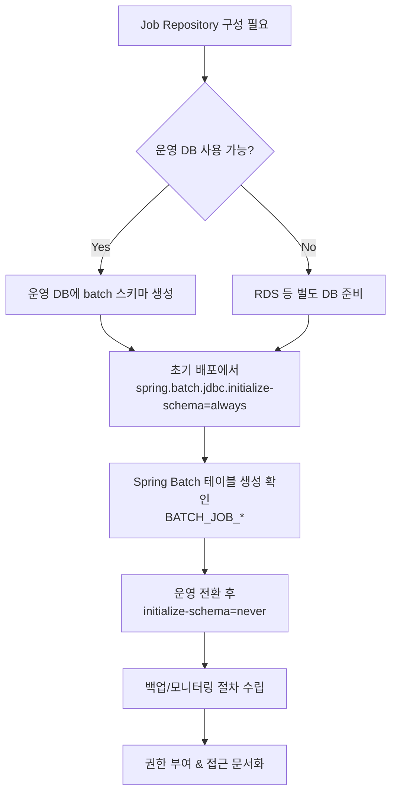

## 2.7 Spring Batch Job 구조

| Step | 설명 | 쉬운 비유 |
| --- | --- | --- |
| Step1 `수집(Tasklet)` | 서울시 API 호출 → 응답 JSON을 메모리/임시 파일에 적재 | 트럭이 원자재를 공장으로 옮겨 한쪽에 내려두는 단계 |
| Step2 `Stage 적재(ItemWriter)` | Step1 결과를 읽어 Stage 테이블에 INSERT/UPSERT | 창고 선반에 상자를 정리하는 일 |
| Step3 `메시지 발행(Tasklet)` | 정제 필요 상자 목록을 메시지 큐에 등록 | 작업지시서를 만들어 작업자에게 배포 |
- Step3는 Stage 테이블에서 “이번 실행(`etl_run_id`)에 새롭게 들어온 레코드”를 찾아 메시지로 만든다.
- 메시지에는 `provider_id`, `etl_run_id`, `stage_table`, `priority` 등 필요한 정보가 들어간다.
- 발행 후 `etl_run_detail` 테이블에 “언제 어떤 메시지를 보냈는지” 기록한다.
- 위 표는 “데이터 파이프라인 상의 주요 Step 흐름”을 보여준 것이다. 정제 워커가 메시지를 소비하는 과정은 별도의 Python 파이프라인에서 처리되며 Spring Batch Job의 일부가 아니다.
- Chunk 기반 Step이 필요한 경우(예: Stage 적재)에는 `ItemReader + ItemProcessor + ItemWriter` 조합으로 세부 Chunk 로직을 구현하고, `Stage 적재` Step 안에서 `chunkSize`를 조정해 대량 데이터를 묶음 처리한다.
- 추가 전처리/검증 Step, 운영 DB 반영 Step 등은 Job 설계에 따라 더 많은 Step으로 확장 가능하며, 필요 시 Python 워커 처리 결과를 검증하는 Step을 뒤에 배치할 수도 있다.

### 2.7.1 Stage & Batch 흐름 도식화

```mermaid
flowchart LR
    subgraph Collect[Step1 수집(Tasklet)]
        A[서울시 API 호출
        (HTTP 요청)] --> B[응답 JSON 파싱]
        B --> C[Raw 데이터 리스트/임시 파일 생성]
    end

    C --> D[수집 결과 전달]

    subgraph StageLoad[Step2 Stage 적재(ItemWriter)]
        D --> E[Chunk 단위 매핑]
        E --> F[Stage 테이블 INSERT/UPSERT]
        F --> G[Chunk 커밋
        (chunkSize=500 등)]
        G --> H[체크포인트 저장
        (Job Repository)]
    end

    F --> I[변경 레코드 조회
    (etl_run_id 기준)]
    I --> J[메시지 페이로드 생성
    (JSON)]

    subgraph Publish[Step3 메시지 발행(Tasklet)]
        J --> K[큐 클라이언트 호출
        (SQS/Redis/RabbitMQ)]
        K --> L[메시지 큐]
        K --> M[실패 시 RetryTemplate]
        L --> N[메시지 ID 수신]
    end

    N --> O[`etl_run_detail` 기록]
    H -.-> O
    subgraph Repo[Job Repository]
        H
    end

    O --> P[알람/모니터링]
```

- 왼쪽에서 오른쪽으로 `수집 → Stage 적재 → 메시지 발행` 흐름을 보여주며, Stage 테이블과 Job Repository가 서로 다른 저장 영역임을 시각화했다.
- Chunk 커밋과 체크포인트가 Job Repository에 기록되고, 메시지 발행 결과는 `etl_run_detail`에 남아 이후 재처리나 알람에 활용된다.

## 2.8 Batch 애플리케이션 준비 절차

1. **코드 저장소 확인**
    - GitHub/Bitbucket 등 사내 저장소에 `spring-batch-seoul`과 같은 프로젝트가 있는지 검색한다.
    - 없으면 표준 템플릿(Gradle, Java 21, Spring Batch 의존성 포함)을 복제해 신규 리포지토리를 생성하고, README에 빌드·배포 절차를 적어 둔다.
    - 협업 규칙(브랜치 전략, 코드 리뷰 프로세스)을 정한 뒤 공유한다.
2. **환경 변수 정리**
    - 필수 변수 목록: `DB_URL`, `DB_USER`, `DB_PASSWORD`, `QUEUE_URL`, `REDIS_URL`, `ADDR_API_KEY`, `RUN_ENV` 등.
    - 개발·스테이징·운영별로 값을 정리한 `.env` 템플릿을 작성하고, 실제 값은 AWS Parameter Store 또는 Vault에 저장한다.
    - 애플리케이션 `application.yml`에는 `${}` 형식으로 값을 주입하도록 설정한다.
3. **도커 이미지 빌드**
    - Dockerfile 예시: 멀티 스테이지(Gradle 빌드 → Slim 런타임) 구성, 실행 명령은 `ENTRYPOINT ["java","-jar","/app/app.jar"]`.
    - CI(예: GitHub Actions)에서 `./gradlew clean build` → `docker build` → `docker push` 순으로 자동화 파이프라인을 만든다.
    - 이미지 태그 규칙(예: `v{릴리스번호}` 또는 `git-sha`)을 문서화한다.
4. **스케줄 설정**
    - Spring 사용 시 `@EnableScheduling`과 `@Scheduled(cron="0 0 2 * * SUN")`을 애플리케이션에 추가한다.
    - 컨테이너 오케스트레이션을 활용한다면 Kubernetes CronJob 혹은 AWS EventBridge + ECS RunTask로 동일한 실행 주기를 구성한다.
    - 스케줄과 실제 API 업데이트 주기가 맞는지(예: 일요일 새벽) 서울시 공공데이터 공지사항을 통해 주기적으로 검토한다.
5. **권한 및 네트워크 설정**
    - VPC/Subnet, Security Group 규칙을 점검해 Batch 컨테이너가 DB, Redis, SQS에 접근할 수 있는지 확인한다.
    - AWS IAM Role에 `sqs:SendMessage`, `secretsmanager:GetSecretValue`, `ssm:GetParameter`, `logs:CreateLogStream` 등 필요한 권한을 부여한다.
    - 사내 방화벽/프록시 환경이 있다면 허용 목록에 서울시 API 도메인, Kakao API 도메인을 추가한다.
6. **로깅·모니터링 연결**
    - Logback JSON Appender를 구성해 구조화 로그를 CloudWatch Logs 혹은 ELK로 전송한다.
    - 주요 메트릭(`etl_run_duration`, `etl_collected_count`, `etl_failed_count`)을 `MeterRegistry` 혹은 CloudWatch `PutMetricData`로 기록한다.
    - 장애 시 알람이 발생하도록 SNS/Slack Webhook을 연결하고, 알람과 재처리 절차를 운영 문서에 명세한다.
7. **릴리스 및 롤백 전략**
    - 운영 반영 전 스테이징 환경에서 배치 Job을 수동 실행해 성공 여부를 검증한다.
    - 롤백 시에는 이전 버전 Docker 이미지와 환경 변수를 재적용하고, 실패 Job이 있으면 Job Repository 상태를 확인 후 재실행한다.
    - 변경 사항은 릴리스 노트에 정리해 팀 전체에 공유한다.

### 2.8.1 준비 절차 흐름도

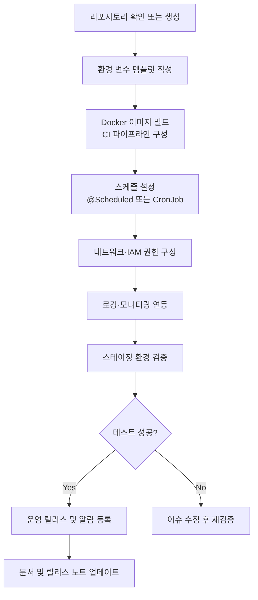

## 2.9 메시지 발행 에러 처리

- 발행 API가 실패하면 `RetryTemplate`으로 1초 → 2초 → 4초 순으로 잠시 쉬었다가 다시 시도한다.
- 여러 번 실패하면 DLQ나 `etl_error_log`에 기록하고 Step3만 재실행한다. 전체 파이프라인이 멈추지 않도록 **체크포인트**를 활용한다.
- **체크포인트란?** Spring Batch가 Chunk Step을 수행할 때 “어디까지 읽고 썼는지” 지점을 `BATCH_STEP_EXECUTION`/`BATCH_STEP_EXECUTION_CONTEXT` 테이블에 저장해 두는 기능이다. 이 정보가 Job Repository에 남아 있어야 재실행이 가능하다.
- **설정 방법**
    1. Chunk 기반 Step(`StepBuilderFactory.get("stageLoad")`)에서 `.chunk(chunkSize)`를 지정하면 기본적으로 `saveState=true`가 적용된다.
    2. Tasklet Step을 사용해야 한다면 `StepExecution`의 ExecutionContext에 직접 진행 정보를 저장하거나, 반복 처리가 많다면 Chunk Step으로 전환하는 편이 안전하다.
    3. Job Repository가 관계형 DB에 구성되어 있어야 체크포인트가 영속적으로 저장된다.
- **체크 및 팔로업 방법**
    - 실패 후 Job을 재실행하면 Spring Batch가 Job Repository에 저장된 체크포인트를 읽어, 마지막 성공 지점 이후부터 데이터를 처리한다.
    - 콘솔/로그에서 `Resuming with StepExecution` 메시지와 함께 `startAt`, `lastCommit` 시점이 출력되는지 확인한다.
    - SQL로 `SELECT * FROM batch.BATCH_STEP_EXECUTION_CONTEXT WHERE STEP_EXECUTION_ID = ?;`를 실행해 `READ_COUNT`, `WRITE_COUNT` 등을 직접 확인할 수도 있다.
    - 운영 모니터링 대시보드에서 최근 실패 Job의 Step 상태(STARTED/FAILED/COMPLETED)를 확인하고, 필요한 경우 `-spring.batch.job.names=CollectJob --run.next=true` 식으로 재실행한다.

### 2.9.1 에러 처리 & 체크포인트 흐름도

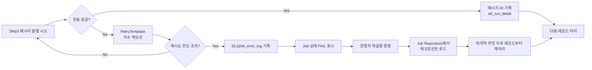

## 2.10 현재 프로젝트 적용 메모 (2024)

- **메시지 큐는 추후 확장 옵션**: 현재 레포지토리에는 SQS/Redis/RabbitMQ 의존성이나 큐 발행 코드가 없으며, 주간 수집량(약 10만 건 이내)은 Spring Batch Chunk Step으로도 충분히 처리할 수 있다. 따라서 1차 구축은 `스케줄러 → Spring Batch → Python 정제 스크립트`가 한 번에 순차 실행되는 구조로 운영한다.
- **Python 정제 호출 방식**: Batch Job이 Stage 적재를 마치면 `ProcessBuilder`, Jenkins, Airflow/Argo Workflow 등에서 Python 스크립트를 즉시 실행해 Stage 데이터를 정제한다. 메시지 큐 없이도 동일한 서버 또는 동일한 배치 실행 흐름 안에서 처리 순서를 보장할 수 있다.
- **큐 도입 기준**: 정제 업무가 다중 팀에서 동시에 소비되거나, 외부 API Rate Limit을 보호하기 위한 비동기 완충이 필요(예: 메시지 10만 건 이상 동시 처리, 정제 시간이 1시간 이상)해지는 시점부터 Section 3의 메시지 큐 설계를 적용한다. 문서의 큐 관련 내용은 이러한 확장 시나리오를 대비해 유지한다.
- **문서/운영 정비**: 현행 순차 구조와 큐 기반 확장 구조를 Confluence/Notion에 나란히 정리해 신규 인원이 “현재 vs 향후” 운영 모델을 빠르게 이해할 수 있게 한다.

## 2.11 주간 자동화 흐름 상세

자동화를 처음 구축하는 사람이 따라 할 수 있도록 각 단계를 “사전 준비 → 구현 → 검증” 순서로 정리했다.

### 2.11.1 스케줄러 세팅 절차

- **사전 준비**
    - `spring-boot-starter-batch`, `spring-boot-starter-web`, `spring-boot-starter-data-redis` 의존성이 `build.gradle`에 포함돼 있는지 확인한다.
    - 운영 환경에서 Batch 애플리케이션을 실행할 계정이 DB/Redis에 접근 가능한지 점검한다.
- **구현 예시 (내부 스케줄러 사용)**: `Appendix A.1`의 `ScheduledBatchRunner.java`를 참고해 동일하게 작성한다. 핵심은 `@EnableScheduling`으로 스케줄러를 활성화하고, `RedisTemplate#setIfAbsent`로 주차 단위 락을 걸어 중복 실행을 막으며, `JobParameters`에 UUID와 실행 시각을 담아 Job Repository에 기록하는 것이다.

- **구현 예시 (외부 스케줄러)**
    1. `./gradlew bootJar`로 `build/libs/backend-batch.jar` 생성
    2. Dockerfile 작성 후 ECR/Artifact Registry에 업로드
    3. Kubernetes CronJob 매니페스트는 `Appendix A.2` 참고. `schedule`, `args`, `envFrom`, `restartPolicy` 필드에 대한 주석을 코드 안에 추가해 두었다.

- **검증 방법**
    - 로컬에서 `./gradlew bootRun` 실행 후 스케줄러 트리거가 어렵다면 `runWeeklyJob()` 메서드를 임시로 `@Scheduled(fixedDelay = 60000)`로 바꿔 동작을 확인하고 로그에 Job ID가 찍히는지 확인한다.
    - Redis에 배치 락 키가 생성되고 삭제되는지 `redis-cli KEYS batch_lock:*`로 확인한다.

### 2.11.2 Spring Batch Job 구성

- **사전 준비**
    - `etl.stage_places_raw` 테이블이 존재하고, `provider_id` 등 인덱스가 생성돼 있어야 한다.
    - 공공데이터 API 키와 요청 파라미터(페이지/사이즈)를 정리한다.
- **Job 설정 코드 골격**: `Appendix A.3`에서 `CollectJobConfig.java` 전체 코드를 확인할 수 있다. `collectJob()`이 Step 순서를 정의하고, `fetchSeoulData()`가 ExecutionContext에 임시 파일 경로를 저장하며, `loadStageStep()`이 Chunk 기반 UPSERT를 수행한다. `@StepScope` 리더를 사용해 Step 실행 시점에 JSON 파일 경로를 주입하는 구조다.

- **메타데이터 기록**
    - `JobCompletionListener`에서 `long readCount = stepExecution.getReadCount();` 등을 조회해 `etl_run_summary` 테이블에 INSERT.
    - Slack Webhook 호출 예시는 `WebhookClient.create(slackUrl).send("[collectJob] 완료 - " + readCount + "건")` 형태로 작성한다.
- **검증 방법**
    - 로컬에서 `./gradlew clean test`로 배치 컴포넌트 유닛 테스트 실행.
    - `./gradlew bootRun --args='--spring.batch.job.name=collectJob run.id=local'`로 실행 후 Stage 테이블에 데이터가 입력됐는지 확인.

### 2.11.3 Python 정제 스크립트 작성

- **사전 준비**
    - `python:3.11-slim` 기반 Dockerfile과 `requirements.txt`를 작성한다.
    - 필수 라이브러리: `pandas`, `SQLAlchemy`, `psycopg2-binary`, `phonenumbers`, `pyyaml`, `aiolimiter`, `httpx`, `python-dotenv`.
- **스크립트 골격**: `Appendix A.4`의 `run_cleaning.py` 예제를 기준 삼아 작성한다. 인자 파싱을 통해 DB/Redis/Kakao 정보를 받아오고, Stage 데이터를 읽어 `normalize_phone`, `normalize_address` 등 단계별 정제 함수를 적용한 뒤 `enrich_with_kakao`로 Kakao 데이터를 결합하고, `upsert_clean_table`로 `stage_places_clean`에 저장한다. 비동기 구조(`asyncio.run`)로 Kakao 호출을 병렬 처리한다.

- **호출 연동**
    - Spring Batch `JobExecutionListener.afterJob` 성공 시 `ProcessBuilder`로 Python 스크립트를 실행한다. 구체적 코드는 `Appendix A.5` 참고.
    - 핵심은 `directory(new File("python"))`로 작업 디렉터리를 맞추고, `inheritIO()`로 Python 로그를 그대로 배치 로그에 노출하며, `waitFor()` 결과가 0이 아닐 때 예외를 던져 알람을 발생시키는 것이다.

- **검증 방법**
    - 로컬에서 `.env` 파일을 준비한 뒤 `python run_cleaning.py --run-id=local --db-url=postgresql://...` 명령으로 단독 실행한다.
    - pytest로 전화번호/주소 정규화 함수에 대한 단위 테스트를 작성해 실패 시 바로 원인을 파악할 수 있게 한다.

### 2.11.4 Kakao API 연동 세부

- **사전 준비**
    - Kakao 개발자 센터에서 REST API 키 발급 → 조직 내 Key Vault/Parameter Store에 저장.
    - 쿼터(일 100만 건)와 상업적 이용 약관을 확인한다.
- **비동기 호출 예시**: `Appendix A.6`의 `kakao.py` 예제를 사용하면 된다. `AsyncLimiter`로 초당 호출량을 제한하고, `fetch_kakao`가 좌표 기반 검색을 호출하며, `enrich_with_kakao`가 `asyncio.gather`로 병렬 실행 후 `merge_rows`에서 성공/실패를 구분한다.

- **Redis 캐싱**
    - `redis.asyncio.from_url(redis_url)`로 연결 후 `await redis.get(cache_key)` → 없을 때만 Kakao API 호출.
- **검증 방법**
    - 개발 환경에서 Stage 데이터 5건으로 테스트하고, Kakao 응답과 Stage 값이 어떻게 병합되는지 print/log로 확인한다.
    - Rate Limiter 설정이 동작하는지 초당 호출수를 CloudWatch/Prometheus로 확인한다.

### 2.11.5 운영 DB 머지 및 리포팅

- **사전 준비**
    - 운영 스키마 `public.places` 구조와 Stage Clean 컬럼 매핑 표를 만든다.
    - 운영 배포용 DB 계정이 UPSERT 권한을 가지고 있는지 확인한다.
- **머지 Step 예시**: 실제 SQL은 `Appendix A.7`에 정리했다. `COALESCE`로 Kakao 보강값을 우선 적용하고, `ON CONFLICT (provider_id)`로 중복을 업데이트 처리하며, `:runId` 바인딩으로 특정 배치 실행분만 반영한다.

- **알림 파이프라인**
    - `JobCompletionListener`에서 Python 스크립트의 처리 건수/카카오 보강 성공률을 읽어 Slack 메시지 생성.
    - 실패 시 PagerDuty 이벤트 API를 호출하거나, 최소한 Slack에 :rotating_light: 이모지와 함께 로그 파일 경로를 남긴다.
- **검증 방법**
    - 스테이징 환경에서 전체 파이프라인을 수동 실행하고, 운영 DB에 삽입된 레코드 수가 Stage Clean과 일치하는지 비교.
    - 실패 케이스를 만들어 Slack/PagerDuty 알람이 정상 발송되는지 확인.

### 2.11.6 자동화 시퀀스 도식

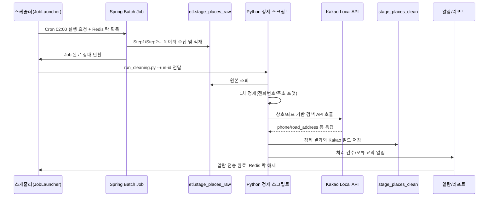

---

# 3. 메시지 큐란 무엇이며 어떻게 만든다?

## 3.1 개념 이해

- 메시지 큐는 서로 다른 시스템을 느슨하게 연결하는 **중간 우체국**이다.
- Spring Batch가 큐에 “정제할 상자 목록(메시지)”을 던져 놓으면, Python 워커가 상황에 맞춰 하나씩 가져간다.
- 큐는 작업량이 몰릴 때 완충 역할을 하고, 실패한 메시지도 다시 꺼내오기 쉬운 구조를 제공한다.

### 3.1.1 메시지 큐 개념 도식

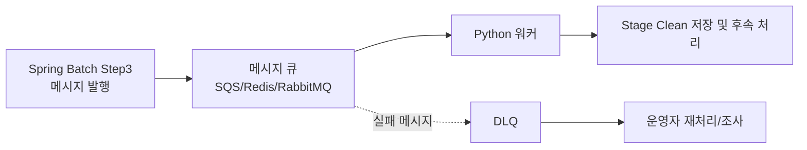

## 3.2 일감 전달 방식 비교

| 옵션 | 특징 | 언제 추천? |
| --- | --- | --- |
| **AWS SQS** | AWS가 운영하는 완전관리형 우체국. `SendMessageBatch`로 묶음 전송 가능, DLQ/재시도 자동 지원. | 클라우드 환경, 안정성을 최우선으로 할 때 |
| **Redis Streams** | 기존 Redis에서 바로 사용 가능. `XADD`/`XREADGROUP`으로 빠르게 처리, `consumer group`으로 워커에게 균등 분배. | 응답 속도가 중요하고 Redis를 이미 운영 중일 때 |
| **RabbitMQ** | 라우팅 규칙이 다양한 브로커. `spring-amqp`와 호환되고, `direct`/`fanout` exchange로 세밀한 라우팅 가능. | 메시지를 카테고리별로 나눠 보내야 할 때 |

### 3.2.1 큐 선택 의사결정 흐름

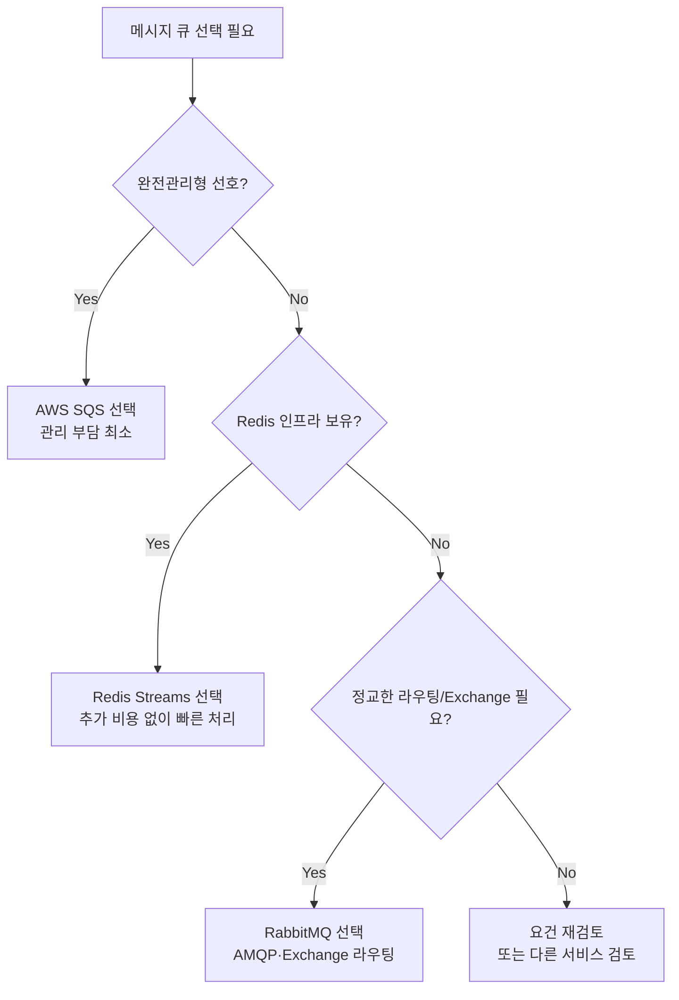

## 3.3 메시지 큐 준비 절차

- **SQS**
    1. AWS 콘솔 접속 → `SQS` 검색 → “Create queue” 클릭
    2. 이름 입력(`restaurant-stage-queue` 등) 후 Standard 타입 선택
    3. `Redrive policy` 설정으로 DLQ 연결 (예: `restaurant-stage-dlq`, `maxReceiveCount=5`)
    4. IAM Role에 `sqs:SendMessage`, `sqs:ReceiveMessage`, `sqs:DeleteMessage` 권한을 부여
    5. 큐 URL과 ARN을 환경 변수나 Parameter Store에 저장
- **Redis Streams**
    1. 현재 운영 중인 Redis 클러스터가 있는지 확인 (없다면 AWS Elasticache 등으로 신규 구축)
    2. 특별히 생성 단계는 없고, 첫 메시지를 보낼 때 `XADD etl:queue * field value` 형식으로 스트림이 자동 생성된다
    3. 워커 분배를 위해 `XGROUP CREATE etl:queue etl-group 0` 명령으로 consumer group을 만든다
    4. Redis 접근 비밀번호/엔드포인트를 환경 변수로 정리한다
- **RabbitMQ**
    1. RabbitMQ 관리 콘솔 접속 → Queue 생성 (`restaurant.stage`) 및 DLQ 생성 (`restaurant.stage.dlq`)
    2. 필요하다면 Exchange(`restaurant.direct`)를 만들고 Queue와 바인딩
    3. Spring Boot 설정(`spring.rabbitmq.host`, `username`, `password`)을 환경 변수로 등록
    4. 워커 컨테이너에서도 동일한 연결 정보를 사용하도록 설정한다

> Tip: 어떤 큐를 선택하든 “큐 이름/주소/권한” 정보를 한 곳에 정리해 두고, Batch와 워커가 같은 값을 사용하도록 조율해야 한다.
> 

### 3.3.1 큐 준비 절차 도식

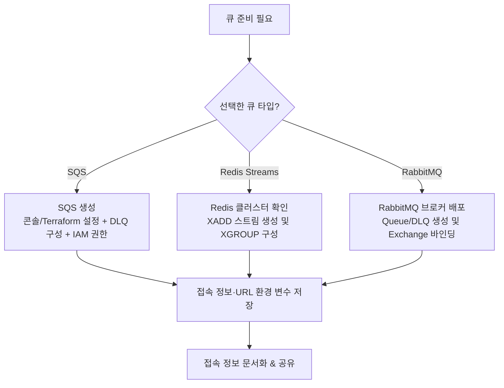

## 3.4 메시지를 큐에 발행하는 단계-by-단계 흐름

1. **정제 대상 레코드 선별**
    - Step3(Tasklet)에서 `stage_places_raw`를 조회해 “이번 실행에서 새로 들어온/변경된 `provider_id` 목록”을 가져온다.
    - 각 레코드에 대해 필요 정보(예: `provider_id`, `etl_run_id`, `stage_table`, `priority`, `timestamp`)를 Map/DTO 형태로 구성한다.
2. **메시지 포맷 결정**
    - 전체 시스템에서 공통으로 이해할 수 있는 JSON 구조를 정의한다.
    - 예시: `{ "providerId": "123", "etlRunId": "2024-06-23-02", "stageTable": "etl.stage_places_raw", "retryCount": 0 }`
    - 이 스펙을 문서화해 Python 워커 팀과 공유하고, 변경 시 버전 필드(`schemaVersion`)를 추가한다.
3. **큐 클라이언트 초기화**
    - SQS: `SqsAsyncClient.builder().region(...).credentialsProvider(...)` 로 클라이언트를 생성하고, 큐 URL을 환경 변수에서 읽어온다.
    - Redis Streams: `RedisClient.create(redisUrl)` 후 `XADD` 명령을 보낼 `StatefulRedisConnection`을 얻는다.
    - RabbitMQ: `ConnectionFactory`로 커넥션을 만들고 `channel.basicPublish(exchange, routingKey, ...)`를 사용할 채널을 연다.
4. **메시지 전송 호출**
    - SQS: `SendMessageRequest.builder().queueUrl(queueUrl).messageBody(jsonString).messageGroupId(optional).build()` → `sendMessage` 호출.
    - Redis Streams: `XADD etl:queue * field value` 형태로 JSON 본문을 넣거나, `XAddArgs`를 사용해 필드별로 저장한다.
    - RabbitMQ: `channel.basicPublish(exchange, routingKey, null, jsonString.getBytes(StandardCharsets.UTF_8))` 호출.
5. **성공/실패 처리**
    - 성공 시 반환된 `messageId`(SQS) 또는 스트림 ID( Redis `1679570841065-0`)를 받아 `etl_run_detail` 테이블에 기록한다.
    - 실패 시 `RetryTemplate`/재시도 로직 실행, 최종 실패하면 DLQ 발행 또는 `etl_error_log`에 에러 원인을 남긴다.
6. **메타데이터 업데이트**
    - `etl_run_detail`에 `status=PUBLISHED`, `published_at`, `message_id`, `queue_name`을 INSERT.
    - 추후 재처리 시 메시지 ID를 이용해 어떤 레코드를 다시 넣어야 하는지 추적 가능하도록 한다.
7. **테스트 및 검증**
    - 개발 환경에서 실제로 큐에 메시지를 보낸 뒤, Python 워커 로그에서 메시지를 받았는지 확인한다.
    - 큐 대시보드(SQS 콘솔, Redis CLI, RabbitMQ 관리 UI)에서 메시지 수와 DLQ 상태를 모니터링한다.

### 3.4.1 메시지 발행 시퀀스 도식

```mermaid
sequenceDiagram    participant Batch as Spring Batch Step3    participant Stage as Stage 테이블    participant Queue as 메시지 큐    participant DLQ as DLQ    participant Detail as etl_run_detail    Batch->>Stage: 정제 대상 레코드 조회    Batch->>Batch: 메시지 JSON 페이로드 구성    Batch->>Queue: 메시지 전송    alt 전송 성공        Queue-->>Batch: 메시지 ID 반환        Batch->>Detail: 메시지 ID/큐 정보/상태 PUBLISHED 저장    else 전송 실패        Batch->>Batch: RetryTemplate 재시도        Batch->>DLQ: 재시도 초과 시 실패 메시지 기록        Batch->>Detail: 실패 상태 및 원인 기록    end    Note right of Detail: 메타데이터를 기반으로<br/>재처리·모니터링 진행
```

---

# 4. Python 워커: 정제 작업 담당자

> 현재 프로젝트는 메시지 큐 없이 Spring Batch Job 직후 Python 스크립트를 실행해 정제를 수행한다. 아래 내용은 이 순차 실행 방식을 기본선으로 설명하며, 큐 기반 병렬화가 필요해질 때 그대로 확장할 수 있다.

## 4.1 워커가 하는 일 한눈에 보기

1. 메시지 큐에서 “어떤 레코드를 정제해야 하는지” 쪽지를 하나 가져온다.
2. Stage 테이블에서 원본 데이터를 읽어온다.
3. 주소 변환, 전화번호 정리, 카테고리 매핑 등 데이터를 손질한다.
4. 결과를 `stage_places_clean` 테이블에 저장한다.
5. 처리 완료 후 메시지를 큐에서 삭제(ACK)한다. 실패하면 DLQ에 넘긴다.

- 큐 미사용 초기 운영에서는 1·5번 단계를 Stage 테이블 건별 반복 조회(`SELECT ... FOR UPDATE SKIP LOCKED`)나 배치 스크립트의 리스트 순회로 대체하고, 실패 건은 별도 에러 테이블/로그에 기록한다.

## 4.2 워커 실행 준비 체크리스트

1. **Python 컨테이너 빌드**
    - 베이스 이미지: `python:3.11-slim`
    - 필수 패키지: `pandas`, `pyproj`, `phonenumbers`, `requests`, `redis`, `psycopg2` 또는 `asyncpg`
    - Dockerfile을 작성하고 컨테이너 레지스트리에 푸시한다.
2. **환경 변수 설정**
    - `QUEUE_ENDPOINT`, `QUEUE_NAME`, `DB_HOST`, `DB_USER`, `DB_PASSWORD`, `REDIS_URL`, `ADDR_API_KEY` 등을 `.env` 또는 Parameter Store에 저장
3. **배포 장소 결정**
    - 초기에는 Docker Compose로 `worker` 서비스로 실행
    - 운영 단계에서는 ECS Fargate, Kubernetes Deployment 등 자동 재시작이 가능한 플랫폼 추천
4. **기동 명령 준비**
    - Celery 예시: `celery -A etl.worker worker --loglevel=INFO --concurrency=4`
    - asyncio 커스텀 워커 예시: `python -m etl.worker`
5. **모니터링 연결**
    - CloudWatch Logs, ELK, Sentry 등으로 stdout/stderr 로그를 수집하도록 설정

## 4.3 정제 로직 구성 요소

- **데이터 타입 정규화**: `pandas`/`pyarrow`로 숫자·문자 형식을 통일
- **전화번호 포맷팅**: `phonenumbers` 라이브러리로 “02-123-4567” 형식 지정
- **카테고리 매핑**: YAML/JSON 룩업 테이블로 자동 변환
- **주소 변환 호출**: 행안부 API → 캐시 미스일 때 Kakao API로 폴백, 응답을 Redis에 저장

### 4.3.1 Kakao Local API 활용 메모

- `카카오 로컬 검색 API`(키워드·카테고리·좌표 기반)는 `place_name`, `phone`, `address_name`, `road_address_name`, `x`/`y`(WGS84 좌표) 등을 반환하므로 전화번호와 도로명/지번 주소를 보강하는 데 활용할 수 있다.
- **주의사항**: 카카오 개발자 센터에서 REST API 키를 발급받고, 기본 할당량(일 100만 건)과 초과 과금 정책을 확인해 Rate Limiter를 설정한다. 상업적 이용일 경우 약관상 별도 제휴가 필요할 수 있다.
- 서울시 원본의 `provider_id`, 상호명, 좌표를 조합해 Kakao API를 호출하고, 응답의 `id` 또는 `place_url`을 Stage Clean 테이블에 기록하면 재검증과 감사에 도움이 된다.
- Kakao 응답이 없거나 불완전할 때를 대비해 행안부 도로명 주소 API 결과와 기존 Stage 데이터를 우선시하고, Kakao 필드를 보조 지표로 병합하는 정책을 문서화한다.
- **구현 순서 제안**
    1. Stage 데이터에서 상호명·좌표·지번 주소를 기반으로 Kakao 검색 API 요청 페이로드 구성
    2. 응답 결과와 Stage 레코드를 매칭하기 위한 키(상호명 정규화 + 거리 기준 등) 정의 및 일치율 계산
    3. 매칭 성공 시 전화번호·도로명 주소·좌표를 정규화해 `stage_places_clean`에 `kakao_phone`, `kakao_road_address`, `kakao_confidence` 등으로 저장
    4. 매칭 실패 시 행안부 도로명 주소 API 결과 또는 기존 Stage 값을 유지하고, 실패 사유를 `etl_error_log` 또는 보조 테이블에 남겨 재검토 대상 식별
    5. 모든 호출은 `aiolimiter` 등으로 초당 호출 수를 제한하고, Redis 캐시나 Stage 로그 테이블에 응답을 저장해 재처리 시 재활용

## 4.4 로그 및 모니터링 체계

- `structlog`로 `run_id`, `message_id`, `duration_ms`, `addr_api_calls`, `status` 등을 JSON 형태로 로깅
- 로그는 Sentry/CloudWatch/ELK로 전송해 알람과 원인 분석에 활용
- 처리량/실패율은 Prometheus나 CloudWatch Metric으로 집계해 대시보드를 구성

---

# 5. Redis 활용: 캐시·락·재처리

| 목적 | 설명 | 준비 방법 |
| --- | --- | --- |
| 주소 변환 캐시 | `SETEX addr:{지번주소}` 형태로 24시간 동안 변환 결과 저장. 다음 실행 시 API 호출을 줄인다. | Redis 클러스터 접근 정보 확보 후 워커 환경 변수에 반영 |
| 작업 잠금(Job Lock) | 스케줄러 실행 시 `SETNX batch_lock:{YYYY-WW}` 키를 만들어 중복 실행을 막고, 완료 시 `DEL` 한다. | Batch 애플리케이션에서 Redis 연결 설정 필요 |
| 재처리 큐 | DLQ에서 꺼낸 메시지를 `LPUSH retry_queue`로 넣고, 별도 재처리 워커가 `BRPOP`으로 처리한다. | Redis에 `retry_queue` 키만 사용하면 되며 추가 설정 불필요 |

> Redis는 이미 운영 중인 인스턴스를 재활용하거나, AWS Elasticache 등 관리형 서비스를 사용한다. 새로운 공간을 만들 필요는 없지만 접근 권한과 보안 그룹을 사전에 확인해야 한다.
> 

---

# 6. 실패 처리와 Dead Letter Queue(DLQ)

1. **SQS 기준**
    - Queue 생성 시 `RedrivePolicy` 설정으로 DLQ 연결 (`maxReceiveCount=5` 권장)
    - 워커가 메시지를 처리하지 못하면 `VisibilityTimeout` 후 자동으로 DLQ로 이동
    - 운영자는 SQS 콘솔에서 DLQ 메시지를 확인하고, 재처리 버튼으로 원 큐에 되돌릴 수 있다
2. **Redis Streams 기준**
    - 워커 장애로 `XACK`되지 않은 메시지는 `Pending Entries List`에 남는다
    - 관리 스크립트 또는 운영자가 `XPENDING`, `XCLAIM` 명령으로 가져와 재시도하거나 별도 스트림으로 옮긴다
3. **RabbitMQ 기준**
    - Queue에 `x-dead-letter-exchange` 설정을 추가해 실패 메시지를 다른 Queue로 라우팅
    - 관리 콘솔에서 DLX/DLQ 상태를 조회하고 재전송할 수 있다

> 실패 메시지 목록은 etl_run_detail과 연동돼 백오피스에서 조회·재전송·폐기(Bulk Delete)가 가능하도록 API를 제공하는 것이 좋다.
> 

---

# 7. 확장성과 Rate Limit 제어

- **워커 수평 확장**: Kubernetes HPA로 SQS 큐 길이나 CPU 사용률을 감시해 워커 수를 자동 조절. Docker Compose 환경에서는 `docker compose up --scale worker=4`처럼 손수 늘릴 수도 있다.
- **Queue의 버퍼 역할**: Stage → 큐 → 워커 구조 덕분에 한 번에 많은 데이터가 들어와도 큐가 대기열처럼 흡수해 외부 API Rate Limit을 보호한다.
- **Rate Limiter**: Python 워커에서 `aiolimiter`, `tenacity`로 초당 호출 수를 제한하고, 429/503 응답 시 1s → 2s → 4s → 8s처럼 대기 시간을 늘린다.
- **메트릭 수집**: `queue_backlog`, `worker_throughput`, `addr_api_success_rate`, `retry_count`, `dlq_size` 등을 CloudWatch/Prometheus에 전송해 대시보드를 구축한다.

---

# 8. 운영 체크리스트 요약

1. **Stage 테이블 준비**: 스키마/테이블 생성, 인덱스 설정, 용량 확인
2. **메시지 큐 개설**: SQS/Redis/RabbitMQ 중 선택 → 큐+DLQ 생성 → 접근 권한/엔드포인트 공유
3. **Batch 애플리케이션 배포**: Docker 이미지 빌드, 환경 변수 세팅, 스케줄 등록
4. **Python 워커 배포**: 컨테이너 빌드, 큐/DB/Redis 접속 정보 설정, 로그 수집 연동
5. **Redis 설정**: 캐시 TTL 정책, 잠금 키 구조, 재처리 큐 사용법 문서화
6. **모니터링/알람**: CloudWatch/SNS/Slack 또는 대시보드 구성 → 실패 시 대응 절차 작성
7. **문서화**: 모든 설정과 접속 정보를 Confluence/Notion 등에 기록해 신규 인원도 하루 안에 운영할 수 있도록 정리

---

# 9. 전체 흐름 도식화

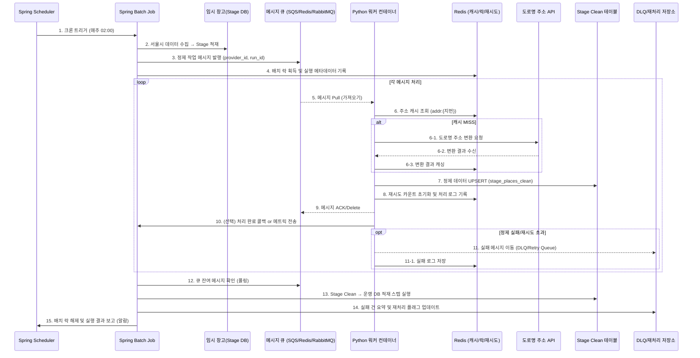

> 도식은 SQS 기준이지만 Redis Streams/RabbitMQ로 대체해도 흐름은 동일하다. 메시지 꺼내기/확인(ACK) 방식만 해당 큐 규약에 맞게 바꾸면 된다.
> 

---

---

# 부록 A. 참고 코드

> 본문에서는 구현 흐름과 설계 이유를 먼저 설명하고, 실제 코드는 참고용으로 한곳에 모았다. 각 파일은 프로젝트에 맞게 패키지명/경로를 조정하면 된다.

## A.1 `src/main/java/com/matjom/matjom/batch/ScheduledBatchRunner.java`

```java
@Component
@RequiredArgsConstructor
@EnableScheduling
public class ScheduledBatchRunner {

    private final JobLauncher jobLauncher;
    private final Job collectJob;
    private final RedisTemplate<String, String> redisTemplate;

    @Scheduled(cron = "0 0 2 * * SUN", zone = "Asia/Seoul")
    public void runWeeklyJob() throws Exception {
        String lockKey = "batch_lock:" + YearWeek.now();
        Boolean lockAcquired = redisTemplate.opsForValue().setIfAbsent(lockKey, "LOCK", Duration.ofHours(3));
        if (Boolean.FALSE.equals(lockAcquired)) {
            log.info("skip batch – lock exists for {}", lockKey);
            return;
        }

        try {
            JobParameters params = new JobParametersBuilder()
                    .addString("run.id", UUID.randomUUID().toString())
                    .addLong("triggeredAt", System.currentTimeMillis())
                    .toJobParameters();
            jobLauncher.run(collectJob, params);
        } finally {
            redisTemplate.delete(lockKey);
        }
    }
}
```

## A.2 `infra/cron/collect-job.yaml`

```yaml
apiVersion: batch/v1
kind: CronJob
metadata:
  name: collect-job
spec:
  schedule: "0 2 * * 0"
  jobTemplate:
    spec:
      template:
        spec:
          containers:
            - name: batch
              image: {REGISTRY}/backend-batch:latest
              args:
                - "--spring.batch.job.name=collectJob"
                - "run.id=$(date +%Y%W)"
              envFrom:
                - secretRef: {DB_SECRET}
                - configMapRef: {BATCH_CONFIG}
          restartPolicy: OnFailure
```

## A.3 `src/main/java/com/matjom/matjom/batch/CollectJobConfig.java`

```java
@Configuration
@RequiredArgsConstructor
public class CollectJobConfig {

    private final JobBuilderFactory jobBuilderFactory;
    private final StepBuilderFactory stepBuilderFactory;
    private final SeoulOpenApiClient seoulOpenApiClient;
    private final StagePlacesWriter stagePlacesWriter;

    @Bean
    public Job collectJob(JobCompletionListener listener) {
        return jobBuilderFactory.get("collectJob")
                .preventRestart()
                .listener(listener)
                .start(fetchSeoulData())
                .next(loadStageStep())
                .build();
    }

    @Bean
    public Step fetchSeoulData() {
        return stepBuilderFactory.get("fetchSeoulData")
                .tasklet((contribution, chunkContext) -> {
                    Path tempFile = Files.createTempFile("seoul", ".json");
                    seoulOpenApiClient.fetchAllPages(tempFile);
                    chunkContext.getStepContext().getStepExecution()
                            .getExecutionContext().putString("sourceFile", tempFile.toString());
                    return RepeatStatus.FINISHED;
                })
                .allowStartIfComplete(true)
                .build();
    }

    @Bean
    public Step loadStageStep() {
        return stepBuilderFactory.get("loadStageStep")
                .<RawPlaceRow, StagePlaceEntity>chunk(500)
                .reader(stageFileItemReader(null))
                .processor(stageItemProcessor())
                .writer(stagePlacesWriter)
                .faultTolerant()
                .retryLimit(3)
                .retry(SocketTimeoutException.class)
                .build();
    }

    @Bean
    @StepScope
    public ItemReader<RawPlaceRow> stageFileItemReader(@Value("#{stepExecutionContext['sourceFile']}") String sourceFile) {
        return new JsonItemReaderBuilder<RawPlaceRow>()
                .name("stageFileReader")
                .resource(new FileSystemResource(sourceFile))
                .jsonObjectReader(new JacksonJsonObjectReader<>(RawPlaceRow.class))
                .build();
    }

    // processor/writer 구현은 별도 클래스에서 작성
}
```

## A.4 `python/run_cleaning.py`

```python
import argparse
import asyncio
import logging
from cleaning.pipeline import load_stage_rows, normalize_phone, normalize_address, upsert_clean_table
from cleaning.kakao import enrich_with_kakao

logger = logging.getLogger("cleaning")


def parse_args():
    parser = argparse.ArgumentParser()
    parser.add_argument("--run-id", required=True)
    parser.add_argument("--db-url", required=True)
    parser.add_argument("--redis-url", required=True)
    parser.add_argument("--kakao-key", required=True)
    return parser.parse_args()


async def main():
    args = parse_args()
    rows = load_stage_rows(args.db_url, run_id=args.run_id)
    normalized = [
        normalize_address(normalize_phone(row))
        for row in rows
    ]
    enriched = await enrich_with_kakao(normalized, args.kakao_key, args.redis_url)
    upsert_clean_table(args.db_url, enriched)
    logger.info("run %s processed %d rows", args.run_id, len(enriched))


if __name__ == "__main__":
    asyncio.run(main())
```

## A.5 `JobCompletionListener`에서 Python 호출 예시

```java
Process process = new ProcessBuilder()
        .command("python3", "run_cleaning.py",
                "--run-id", jobExecution.getJobId().toString(),
                "--db-url", System.getenv("STAGE_DB_URL"),
                "--redis-url", System.getenv("REDIS_URL"),
                "--kakao-key", secrets.get("KAKAO_API_KEY"))
        .directory(new File("python"))
        .inheritIO()
        .start();
int exitCode = process.waitFor();
if (exitCode != 0) {
    throw new IllegalStateException("Python cleaning failed: " + exitCode);
}
```

## A.6 `python/cleaning/kakao.py`

```python
import asyncio
import httpx
from aiolimiter import AsyncLimiter

limiter = AsyncLimiter(10, 1)  # 초당 10건


async def fetch_kakao(session: httpx.AsyncClient, keyword: str, x: float, y: float):
    async with limiter:
        resp = await session.get(
            "https://dapi.kakao.com/v2/local/search/keyword.json",
            params={"query": keyword, "x": x, "y": y, "radius": 200},
        )
        resp.raise_for_status()
        return resp.json()["documents"]


async def enrich_with_kakao(rows, kakao_key, redis_url):
    async with httpx.AsyncClient(headers={"Authorization": f"KakaoAK {kakao_key}"}) as session:
        tasks = [fetch_kakao(session, row.search_keyword, row.lon, row.lat) for row in rows]
        results = await asyncio.gather(*tasks, return_exceptions=True)
    return merge_rows(rows, results)
```

## A.7 `sql/merge_stage_clean.sql`

```sql
INSERT INTO places (provider_id, name, phone, road_address, jibun_address, category, updated_at)
SELECT
    c.provider_id,
    COALESCE(c.kakao_name, c.name) AS name,
    COALESCE(c.kakao_phone, c.phone) AS phone,
    COALESCE(c.kakao_road_address, c.road_address) AS road_address,
    c.jibun_address,
    c.category,
    NOW()
FROM etl.stage_places_clean c
WHERE c.run_id = :runId
ON CONFLICT (provider_id)
    DO UPDATE SET
        name = EXCLUDED.name,
        phone = EXCLUDED.phone,
        road_address = EXCLUDED.road_address,
        updated_at = NOW();
```

---

이 문서를 따르면 비기술자도 “어떤 순서로 공간과 설정을 마련해야 하는지” 이해할 수 있고, 개발자는 실제 구현에 필요한 상세 정보(라이브러리, 환경 변수, 재시도 정책 등)를 바로 활용할 수 있다.
